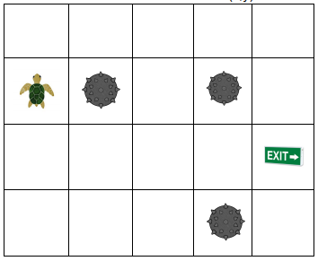

# Turtle Challenge

This project is a proposed solution for the Turtle in a minefield problem.

A turtle should walk on a board, avoiding the mines so that it can hit the exit.



## Using the program

To use this program, invoke the executable passing as parameter the settings file and the moves file.

```
TurtleChallenge.exe game-settings.json moves
```

### Settings File

The Settings file is a JSON file as bellow:

```
{
  "BoardSize": {
    "M": 4,
    "N": 5
  },
  "StartingPosition": {
    "X": 0,
    "Y": 2,
    "Direction": "North"
  },
  "ExitPoint": {
    "X": 4,
    "Y": 1
  },
  "Mines": [
    {
      "X": 1,
      "Y": 2
    },
    {
      "X": 3,
      "Y": 0
    },
    {
      "X": 3,
      "Y": 2
    }
  ]
}
```
* BoardSize - defines the size of the board.
  * Max board size is 1000 x 1000.
  * Min board size is 2 x 2.
  * This field is required.
* StartingPosition - defines the initial position of the turtle on the board and the direction.
  * This field is required.
* ExitPoint - defines the exit point. This field is required.
* Mines - defines an array of positions to the mines.
  * Max number of mines is 100.
  * Mines are not required.

### Moves file

The Moves file is a plain text file as bellow:

```
mrmmmmrmm
mrmmmmrrmmmrmmmmrmm
rrmmmrmm
```

* Each line is a Sequence of moves.
* This file can contain many sequences.
* Each Sequence is a string of moves and rotates.
  * m - means move.
  * r - means rotate.

## Have fun :smile: